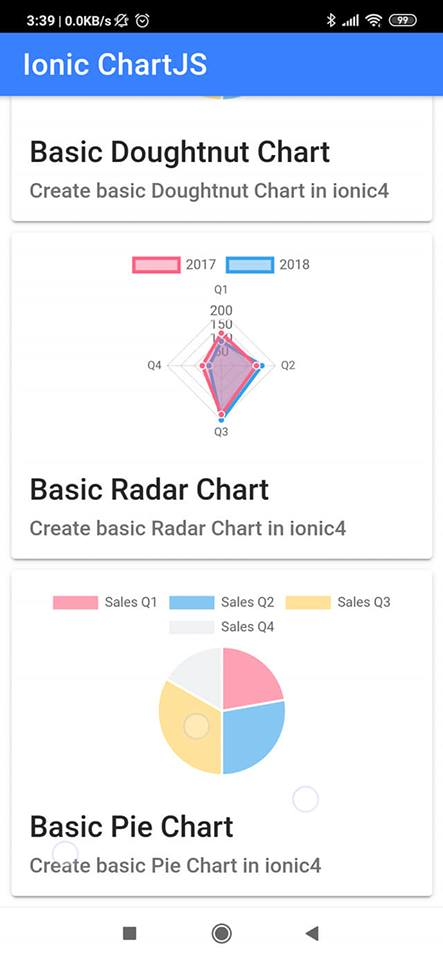
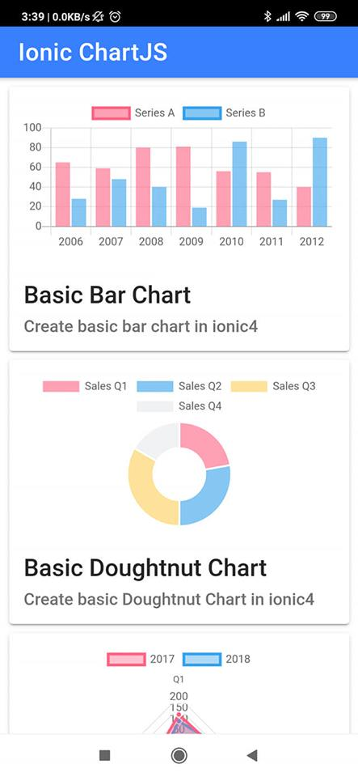

### Build ionic4 with Chart.js

#### Description
`Integrated ChartJS into ionic4 capacitor`

--------------------
#### Clone Project
`git clone https://github.com/sutin1234/ionic4-chartjs.git`
`cd ionic4-chartjs`
`npm install`

--------------------
#### Serve Project
`ionic serve -o`
`npm run start`

--------------------
#### Build Project
`npm run build`

--------------------
Build Project Capacitor
`npm run build`
`npx cap copy android | npx cap copy ios`
`npx cap open android | npx cap open ios`

--------------------
#### Screenshort

#### Resources referrents
https://www.chartjs.org/
https://valor-software.com/ng2-charts/